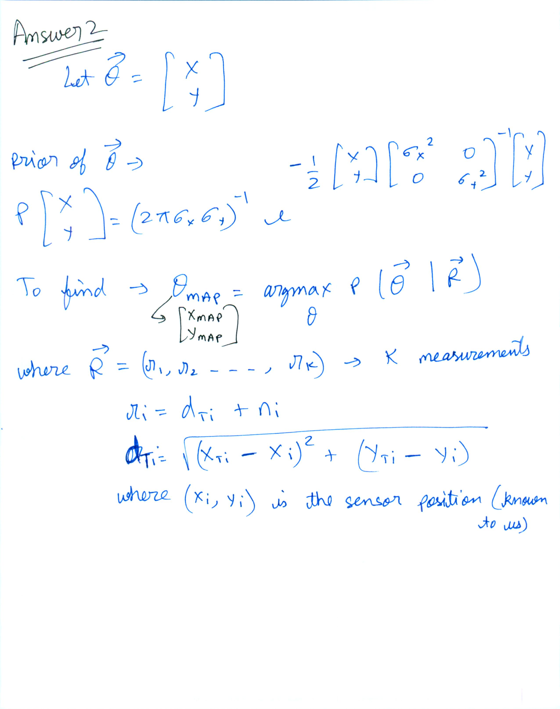

Github repo for this exam-
https://github.com/rohinarora/EECE5644-Machine_Learning/Exam1/

Additionally all the code and figures are present in this file, and also attached on blackboard as additional reference
**Answer 1**

* 3 Gaussian classes are generated by applying linear transformations to a gassuian with zero mean and I (identity) covariance.
* Minimizing P(error) implies MAP estimate.
* For MAP, we need to select the class that maximizes un-normalized posterior-
  * decide class D = argmax (i) P(x|L=i)P(L=i)
  *  
* Number of samples generated from each class-
  * Class 1- 1492
  * Class 2- 3550
  * Class 3- 4958

**Answer 2**

Visualization of the data-

The code is well commented explaining the steps

**sigma_x=0.25
sigma_y=0.25
sigma_i=0.3**

* Behavior of the MAP estimate based on  centre of contour-

>The MAP estimate moves closer to the true position of object as we get data from more sensors. In the contour plots, black regions are peaks and red regions are the valleys. valleys represent minima. In 1st plot, we don't even see black contours. The objective is extremely uncertain about the true location of object. As number of sensors increase, we see red region getting concentrated in a region, and black circles coming in the view. This represents deeper valleys, and more confidence about the true location. Further, the red circles are very close to true location in last image (4 sensors). MAP objective is also exactly correct about the true location in this case.

Github- https://github.com/rohinarora/EECE5644-Machine_Learning/Exam1/Question-2.ipynb
HTML- Attachment Question-2.html
