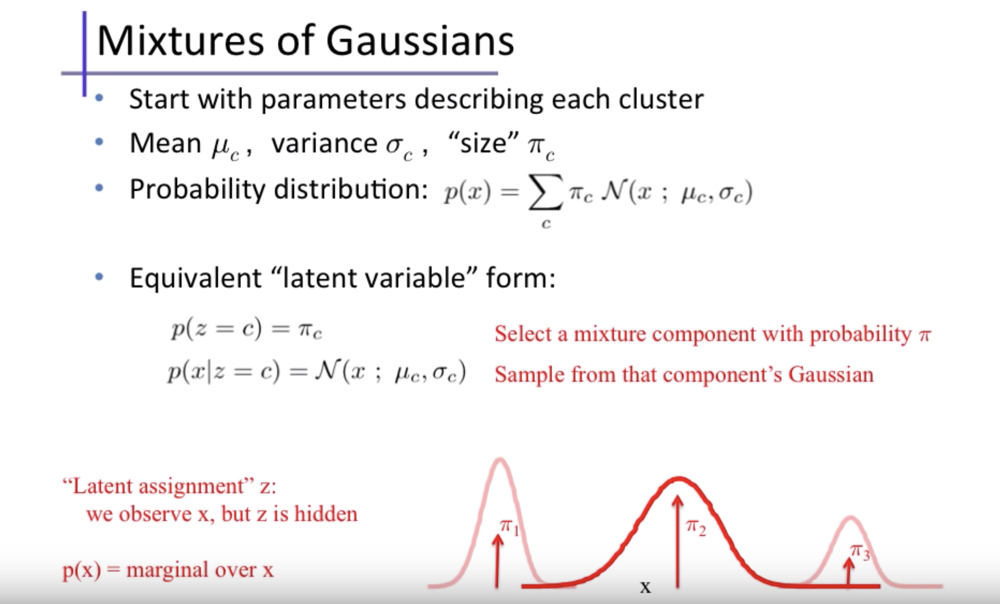
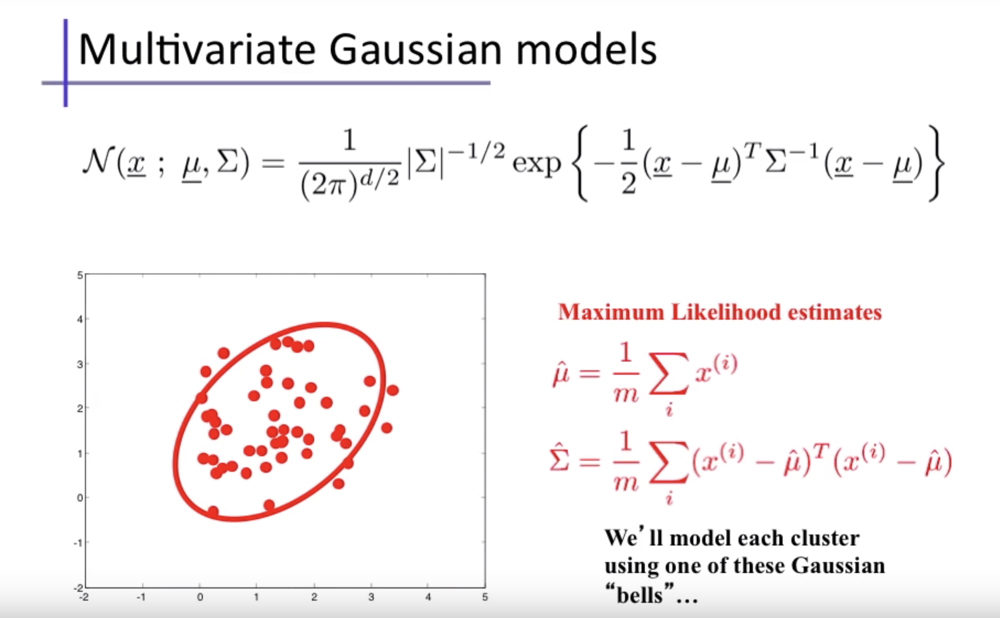
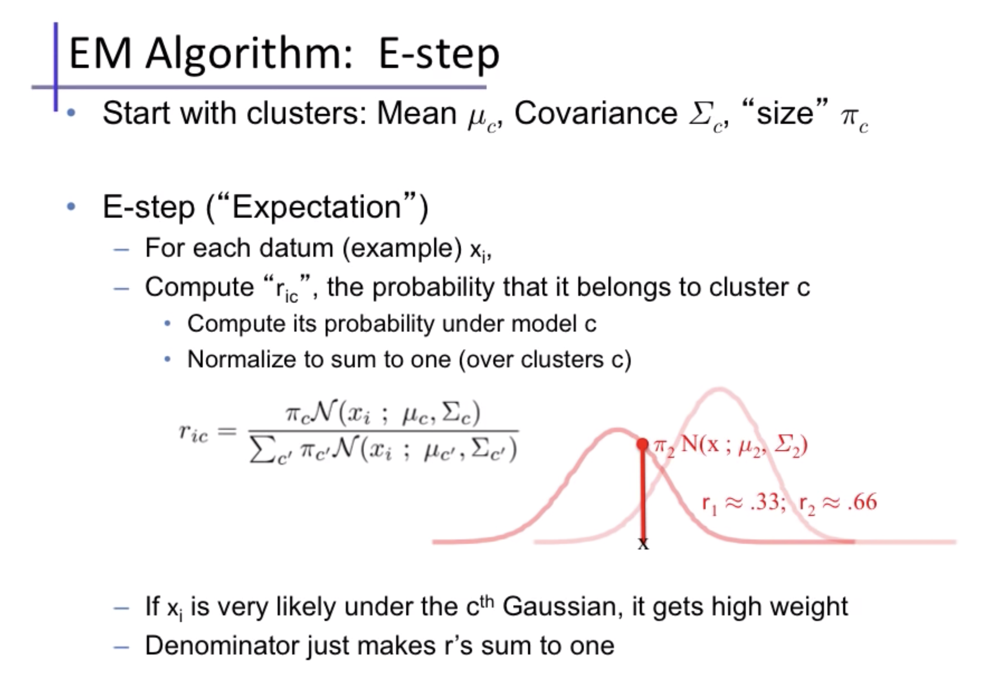
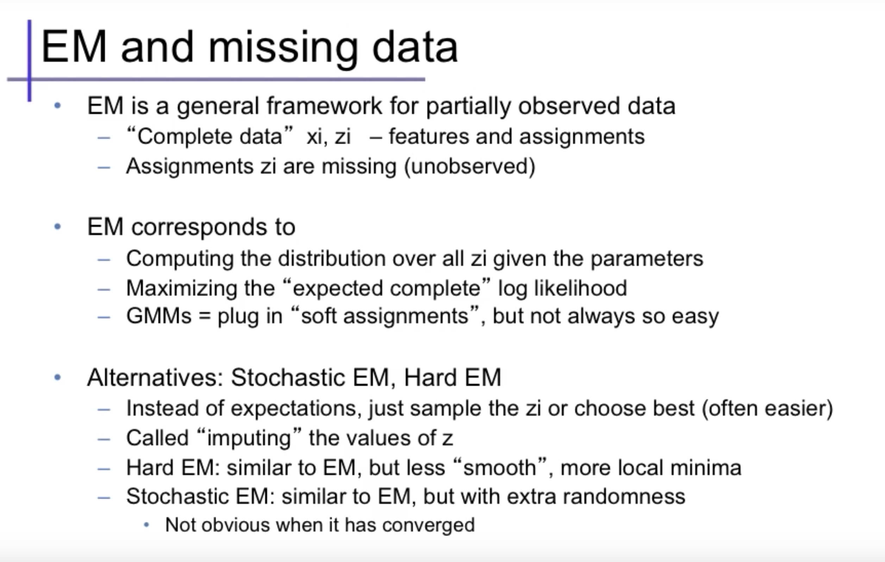

**Expectation-Maximization**
* Q. Is EM ML or MAP? What makes it ML/MAP?
* Is EM anyway related to Policy Iteration?
* Mixture models
  * Probabilistic way of doing soft clustering
  * Each cluster is a generative model (eg gaussian)
  * parameters (mean, cov etc) are unknown
* EM algo
  * discovers the parameters for all "K sources"
* EM is like k means, except in "E" step; we put probabilities (soft label); instead of hard label as in k means
* The parameters of the GMM model are "latent variables". EM can be applied anywhere we come across "latent variables". Eg. in HMM.
* EM algorithm particularly works well when the latent variables come from exponential family
* EM not guaranteed to give $\theta_{MLE}$ if distribution is multi modal (might get stuck in local minima)
* MLE EM may overfit. Solution- MAP EM
* E and M step may not be analytic expressions if latent variables latent variables are not from exponential family
* $\pi_c$ below is the prior of class c. Prior is also unknown, and its also updated in the E step

* Refer ./13c.EM-algorithm.pdf
