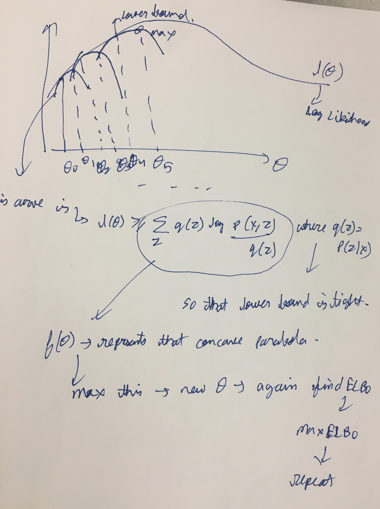

* Optional. [L12 Andrew Ng](https://www.youtube.com/watch?v=ZZGTuAkF-Hw)
**k means**
* ./cs229-notes7a_kmeans.pdf
  * Q. How is k mean gradient descent? Show the math
* ./cs229-notes7b_kmeans.pdf - intro to GMM
  * for GMM , we’ll find that it is not possible to find the maximum likelihood estimates of the parameters in closed form. Why?
* ./cs229-notes8_EM.pdf
  * Pg 3. Why non convex?
  * ELBO says take Q(z) to be posterior of z. I understand the math. Does this have any physical/practical significance? Intuition of selecting Q has posterior. Q has posterior seems to be the only and best option (mathematically)
  * Pg 7. Yellow part. 1st line of equations. How. I understood the rest. 
* Ng explains the EM lower bound graph well

* Q. Is EM ML or MAP? What makes it ML/MAP?
* Is EM anyway related to Policy Iteration?
* Mixture models
  * Probabilistic way of doing soft clustering
  * Each cluster is a generative model (eg gaussian)
  * parameters (mean, cov etc) are unknown
* EM algo
  * discovers the parameters for all "K sources"
* EM is like k means, except in "E" step; we put probabilities (soft label); instead of hard label as in k means
* The parameters of the GMM model are "latent variables". EM can be applied anywhere we come across "latent variables". Eg. in HMM.
* EM algorithm particularly works well when the latent variables come from exponential family
* EM not guaranteed to give $\theta_{MLE}$ if distribution is multi modal (might get stuck in local minima)
* MLE EM may overfit. Solution- MAP EM
* E and M step may not be analytic expressions if latent variables latent variables are not from exponential family
* $\pi_c$ below is the prior of class c. Prior is also unknown, and its also updated in the E step

* Refer ./13c.EM-algorithm.pdf
