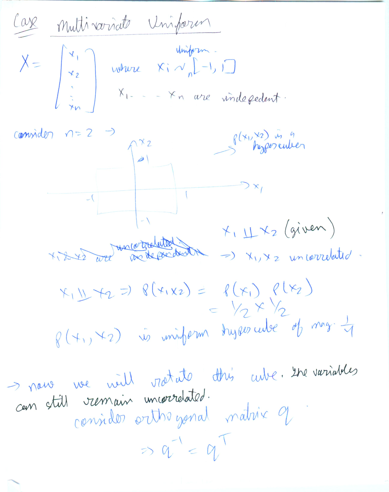

* https://en.wikipedia.org/wiki/Multivariate_normal_distribution#Conditional_distributions

* https://stats.stackexchange.com/questions/86487/what-is-the-meaning-of-the-density-of-a-distribution-at-a-point

* https://math.stackexchange.com/questions/1412015/intuitive-meaning-of-the-probability-density-function-at-a-point

* 3D plotting -
  * https://matplotlib.org/1.5.0/mpl_toolkits/mplot3d/tutorial.htmls
  * https://jakevdp.github.io/PythonDataScienceHandbook/04.12-three-dimensional-plotting.html
  * https://stackoverflow.com/questions/36013063/what-is-the-purpose-of-meshgrid-in-python-numpy
  * https://www.geeksforgeeks.org/numpy-meshgrid-function/
