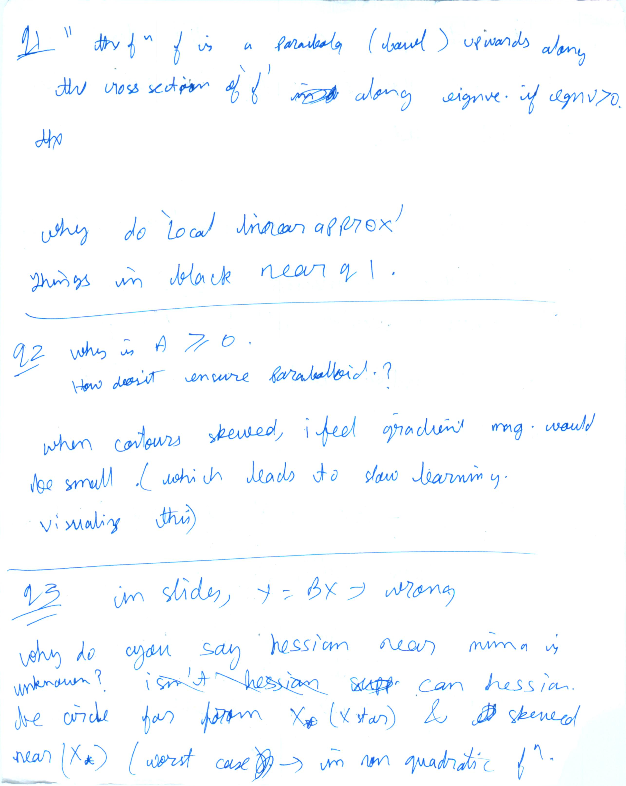

* Think of gradient as a first derivative of simple function like parabola. And hessian as second derivative of the simple function. The intuition directly transfers when x is a vector values complex function, first derivative is a gradient with column vector, and hessian is second derivative. The roots of
* Global and local minima
* Equality constraints are almost always active. They are inactive in the rare case when Equality constraint surface passes through unconstraint optimum value.
* Inequality constraints may or may not be active. In general, and constraint is active if it plays an "active" role in preventing the solution to reach unconstraint minima
* All constraints become inactive in EM algorithm (to fit GMM)
* When training SVM, some constraints active. Most inactive
* For active constraints, langrange multiplier is positive. Else 0.
* Can look at values of langrange multiplier and decide if constraints could be relaxed
* 2nd order constraints for constraint optimization skipped
##### PCA as a optimization problem with eqaulity constraints

* "eigenfaces"
* The n principle components form a new basis for the original vector $\vec{x}$

* LDA - next lecture. optimization problem without constraints

