* decision boundary given by SVM, Fisher LDA, logistic regression.
* generalized eigenvalue/eigenvector https://en.wikipedia.org/wiki/Eigendecomposition_of_a_matrix#Generalized_eigenvalue_problem
* 2nd derivative to find maxima
* want-
  * min $\sigma_1^{_2}$ and $\sigma_2^{_2}$
    * same as min $\sigma_1^{_2}+\sigma_1^{_2}$
    * same as max $(1/\sigma_1^{_2}+\sigma_1^{_2})$
* Bayes decision theory.  
  * Chapter 2 Duda and Hart
  * Eq 13 imp
  * Eq 17. Special case of 2 classes
  * Eq 19. "The risk corresponding to this loss function is precisely the average probability of error, since the conditional risk is"- Good.
  * Eq 20. "to minimize the average probability of error, we should select the i that maximizes the posterior probability"

  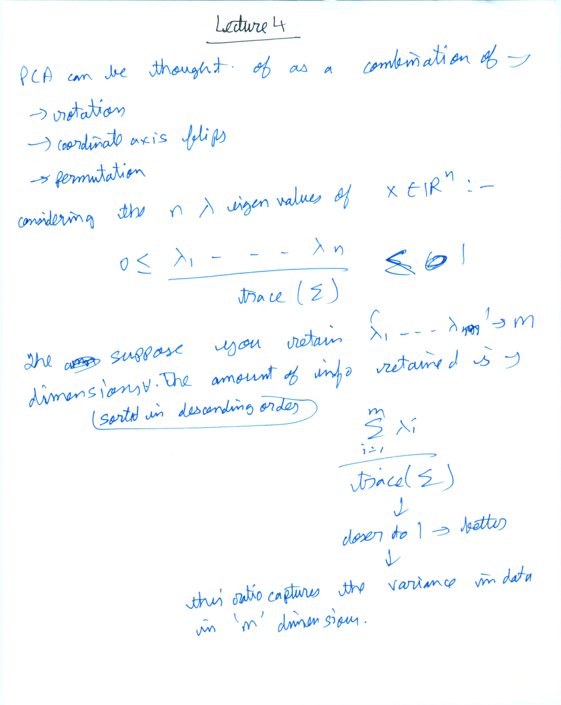
  
  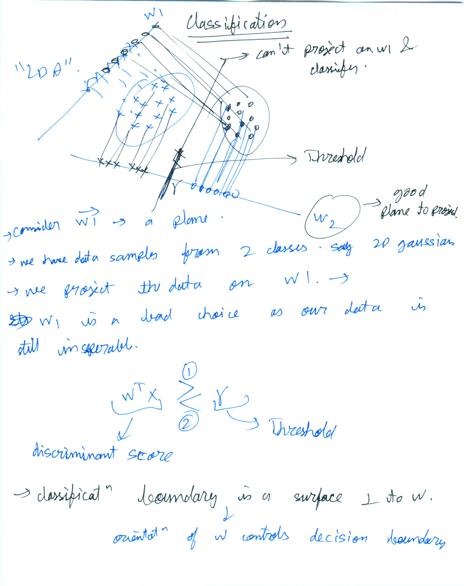
  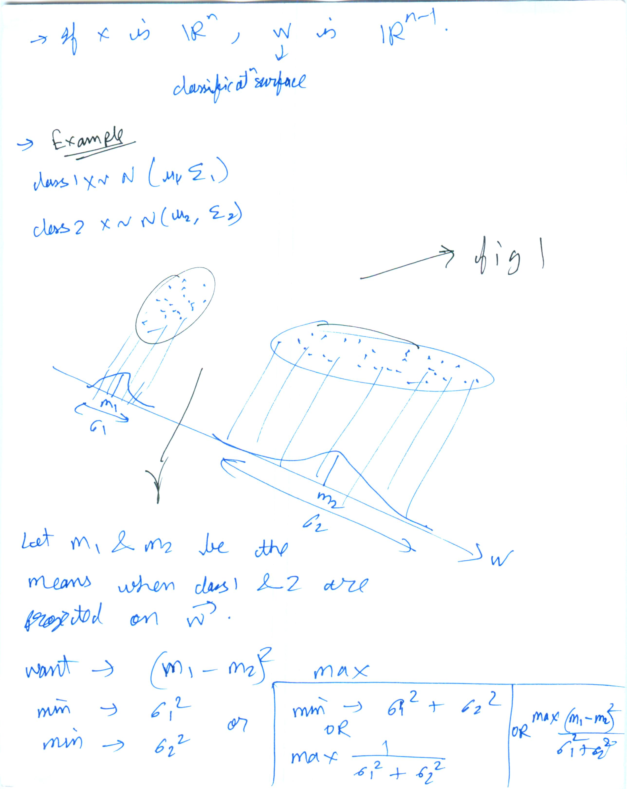
  The data is tranformed by some linear operator (w)T\*x. Mean of tranformed data would be (w)T*(original_mean)
  And variance (w)T*(original_variance) * w
  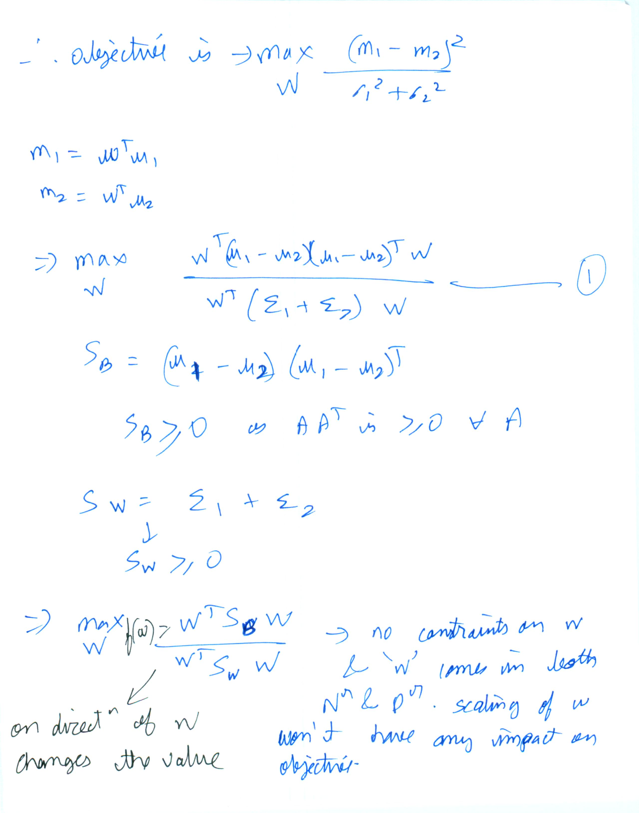
  ^  The objective only depends on the direction of w vector
  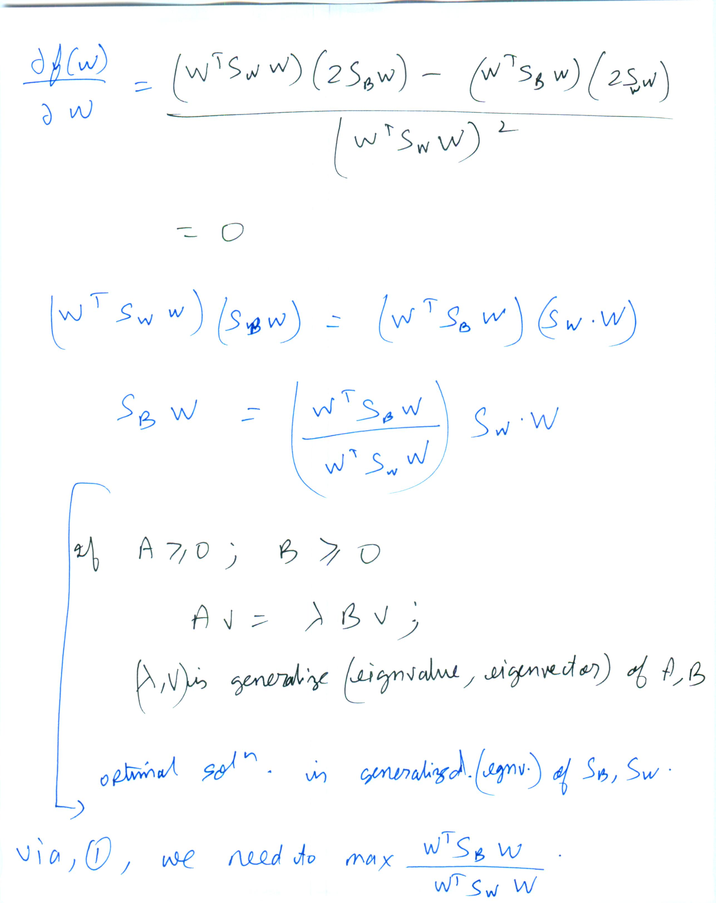

  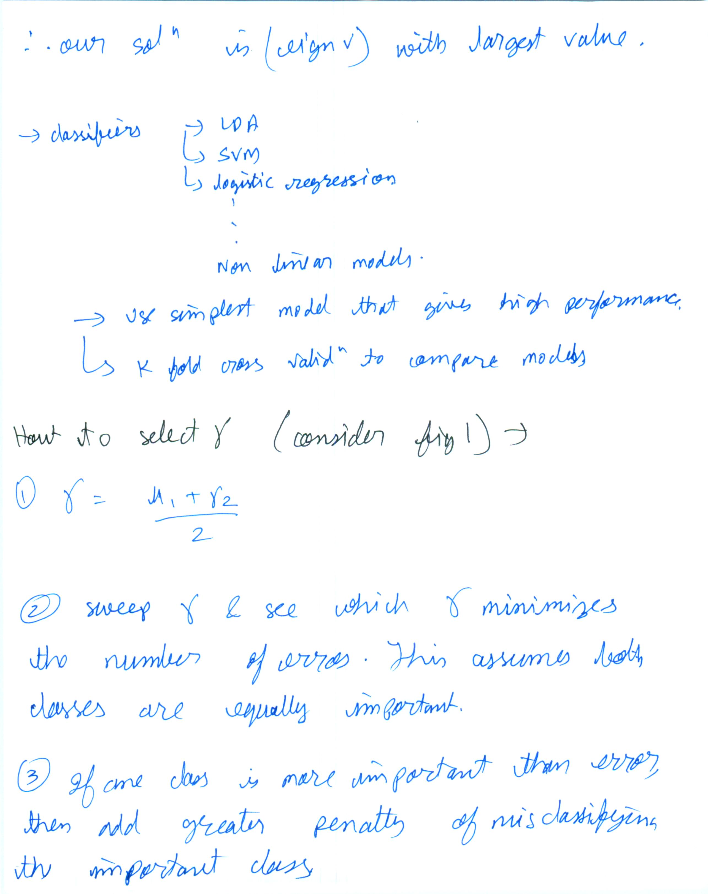
  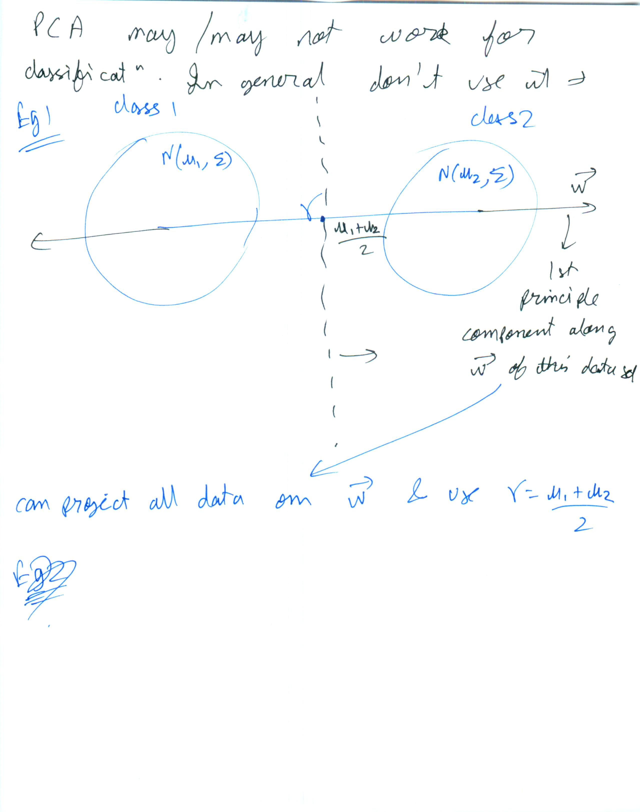
  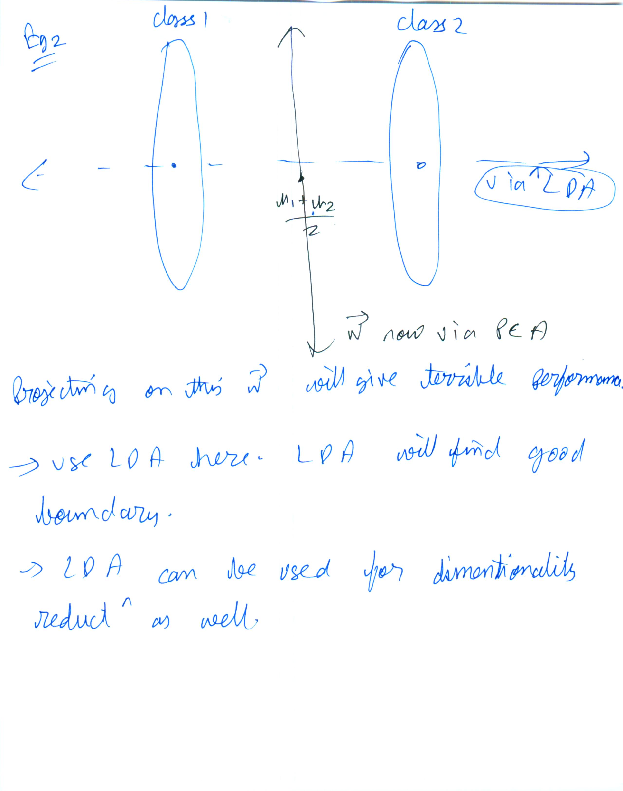
  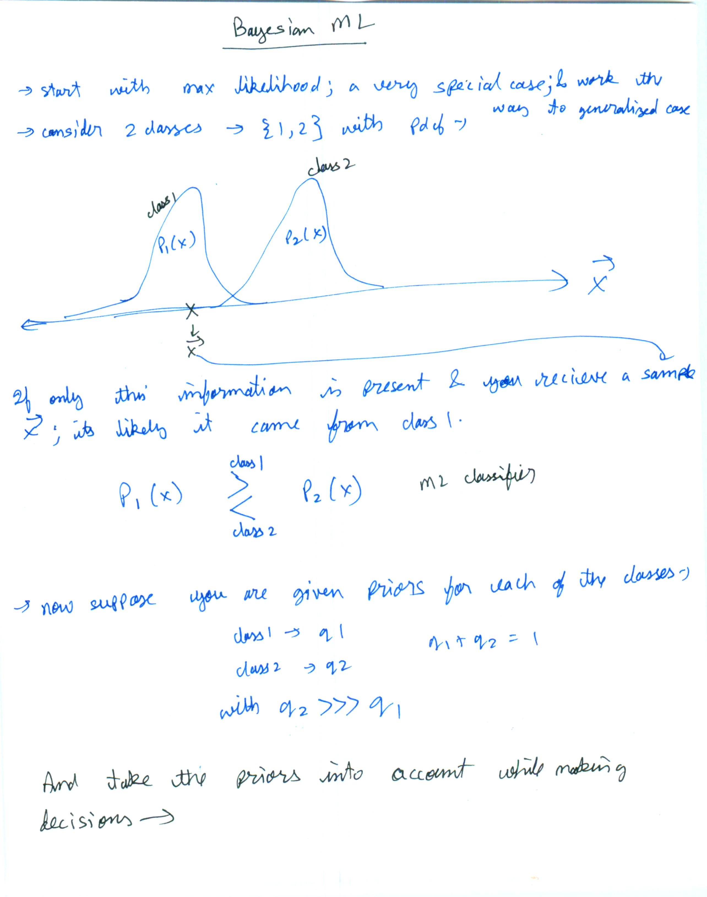
  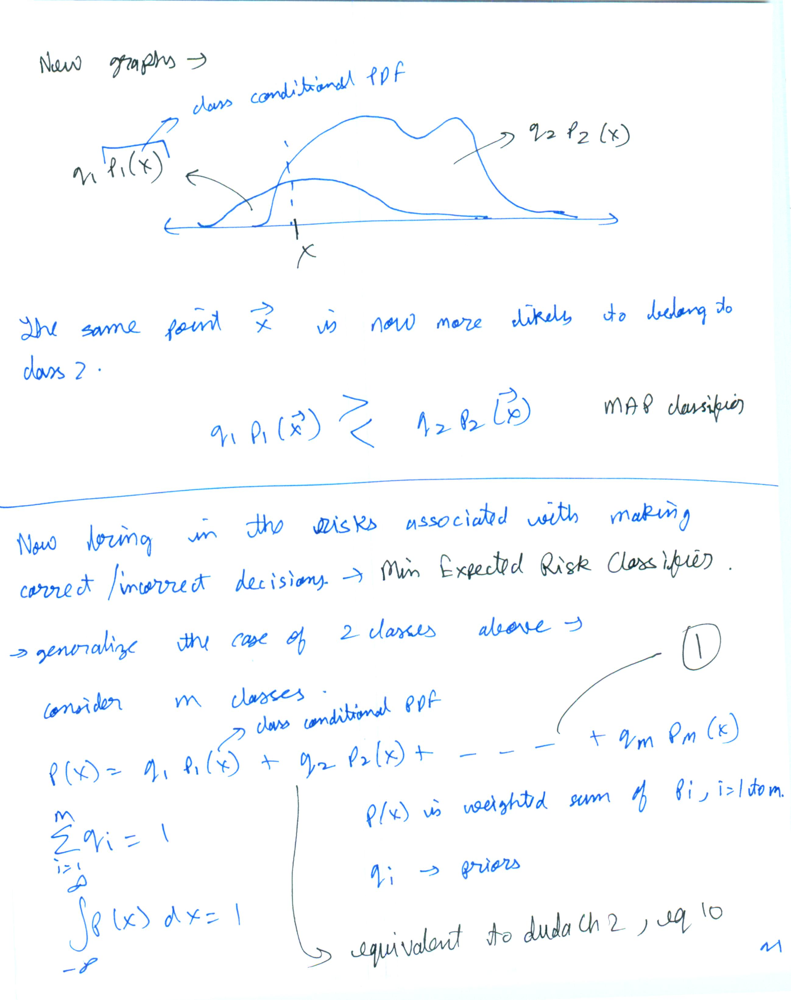
  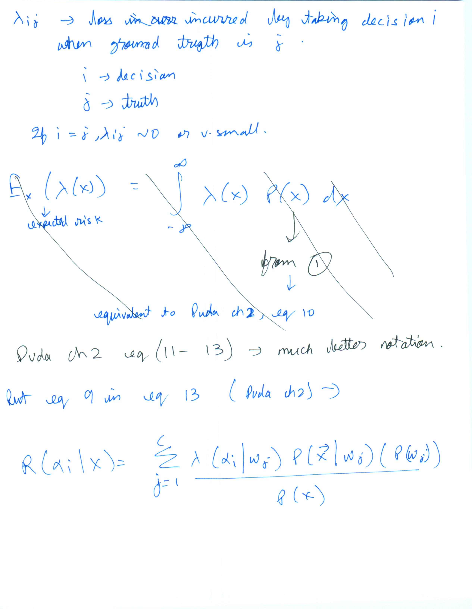
  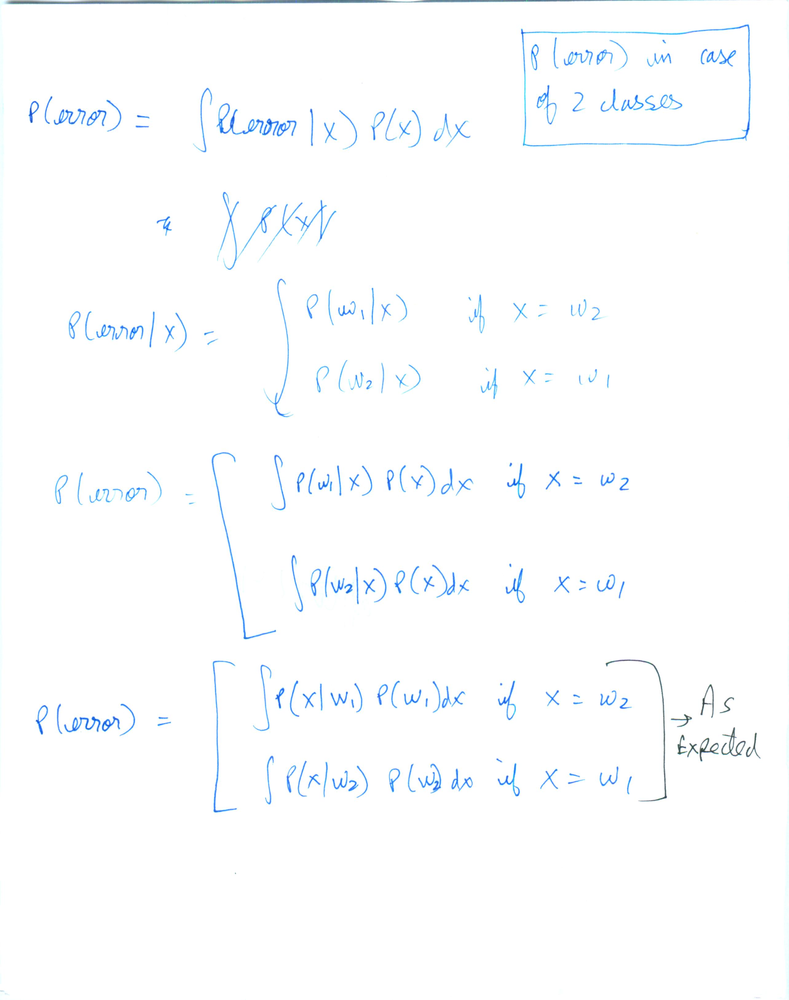
