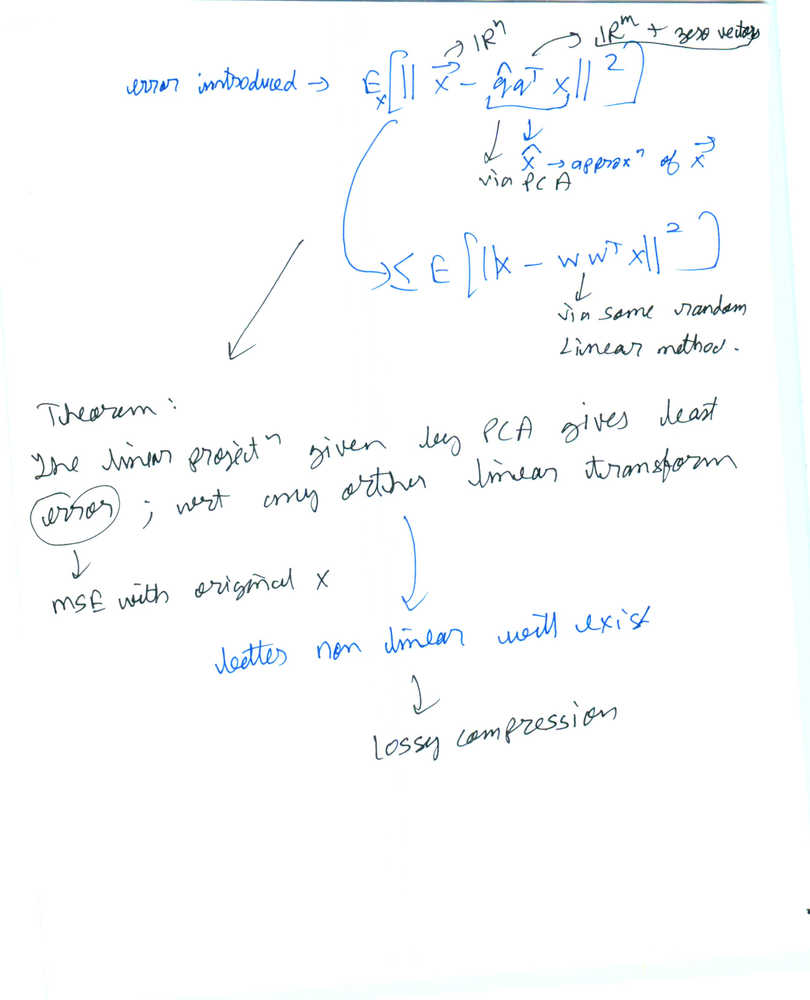

* decision boundary given by SVM, Fisher LDA, logistic regression.
* generalized eigenvalue/eigenvector
* 2nd derivative to find maxima
* how to choose $\gamma$.
  * do we not need any distance metric in the error function?
* want-
  * min $\sigma_1^{_2}$ and $\sigma_2^{_2}$
    * same as min $\sigma_1^{_2}+\sigma_1^{_2}$
    * same as max $(1/\sigma_1^{_2}+\sigma_1^{_2})$
* Bayes decision theory.  
  * Chapter 2 Duda and Hart

  
  
  
  
  
  
  
  
  
  
  
  
