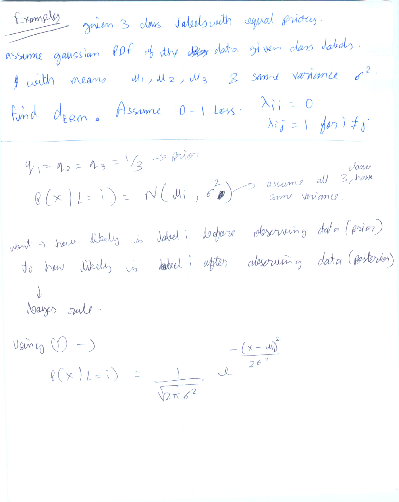
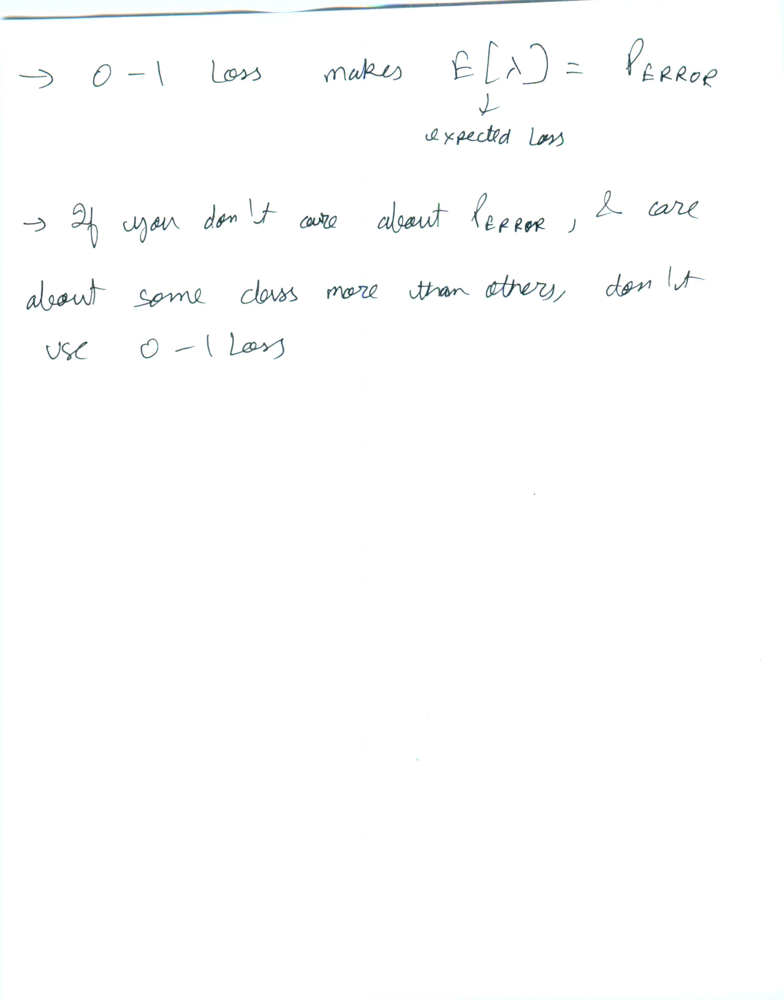
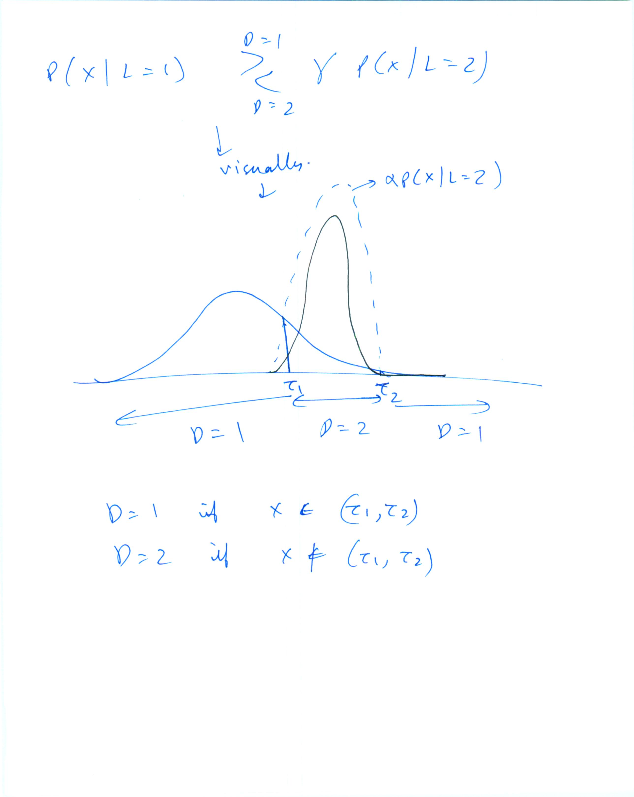

error term below is incorrect. should have prior prob term as well.     
Eg- P(D=2|L=1)\*P(L=1)

Below. If you did't have 0-1 loss, indeed you would have taken some lambda1, lambda2 loss functions. In that case, the decison boundary would also have been different. Would have to re compute \tau

Below expected risk is a modified form of Eq 12, 13 Duda Ch2 

