* Go through sampling again (mathematical monk). Notes are present in bag.
Parametric estimation
* In real life, data PDF is unknown.
* Previously we saw classification; where targets were discrete. Now we are seeing parametric estimation where the labels are continuous.
* The ML and MAP definitions we say previously for classification relate to ML and MAP definitions in parametric estimation
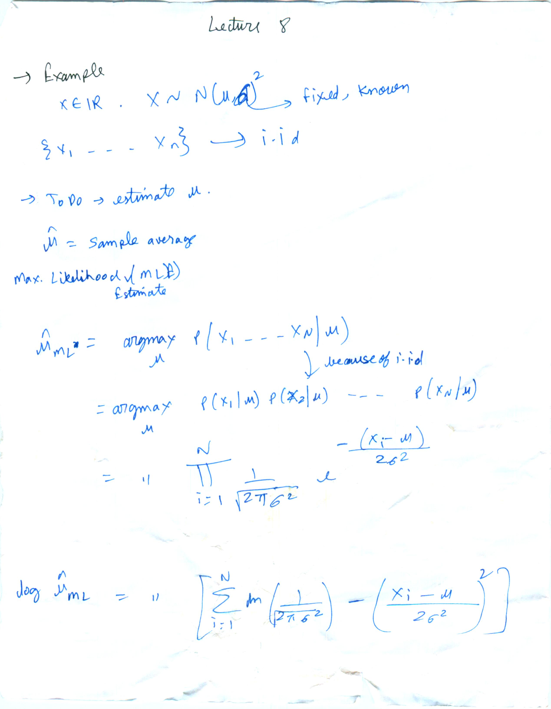
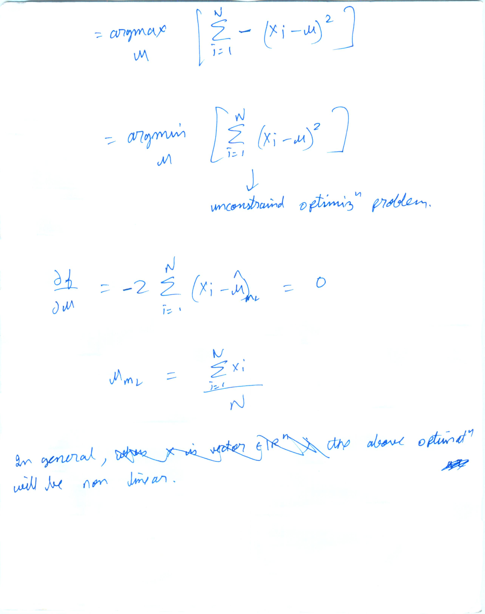
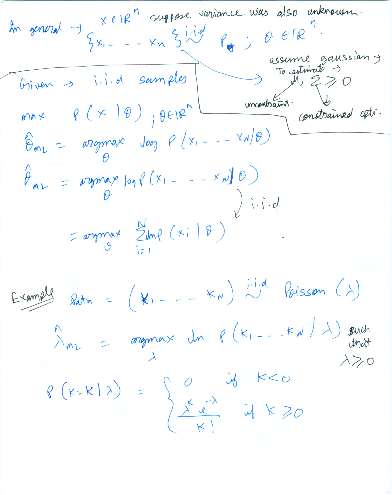
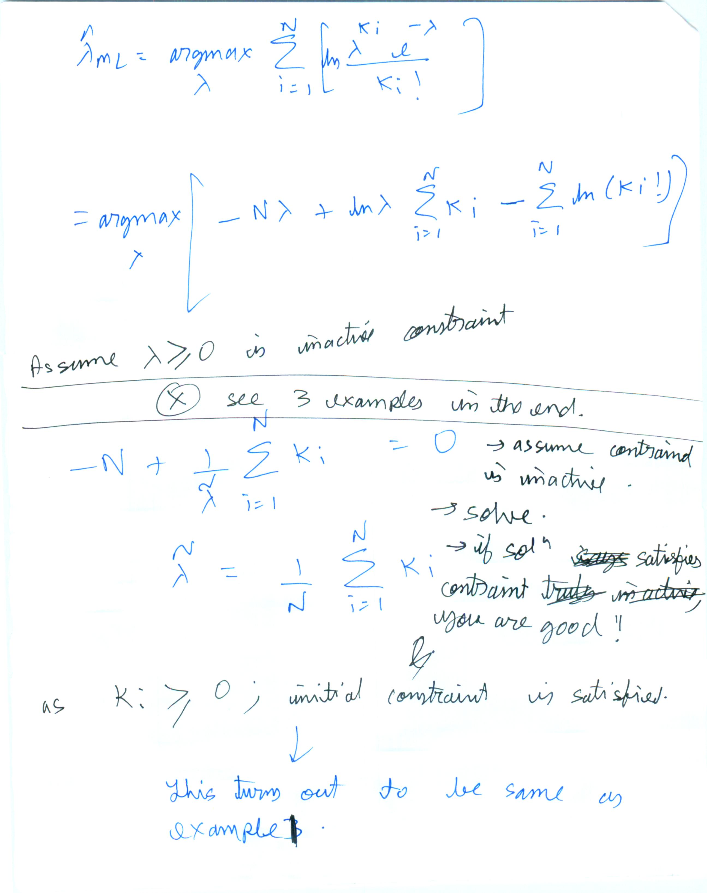
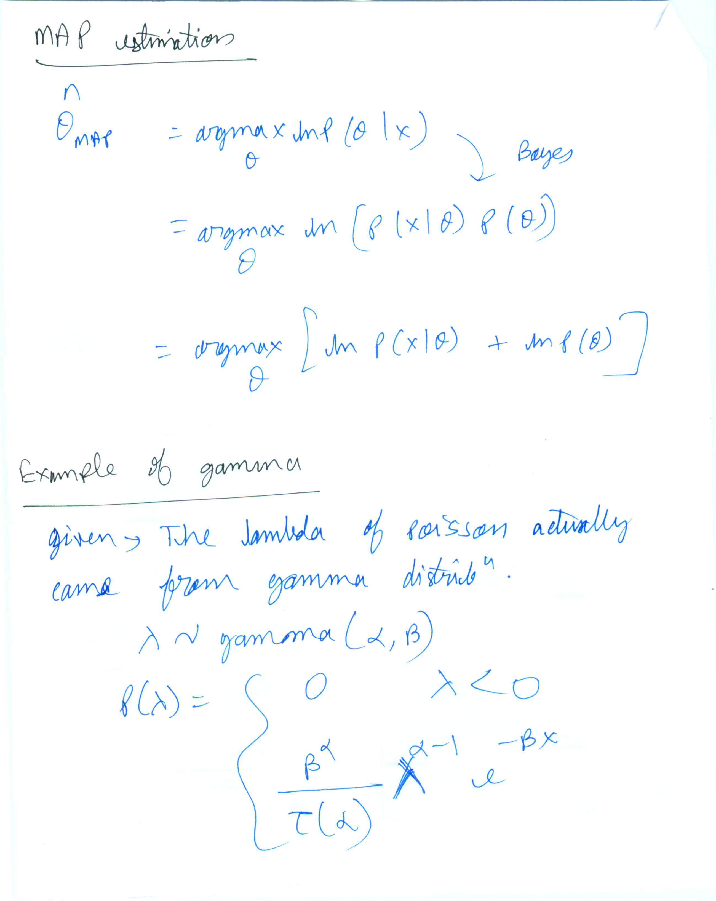
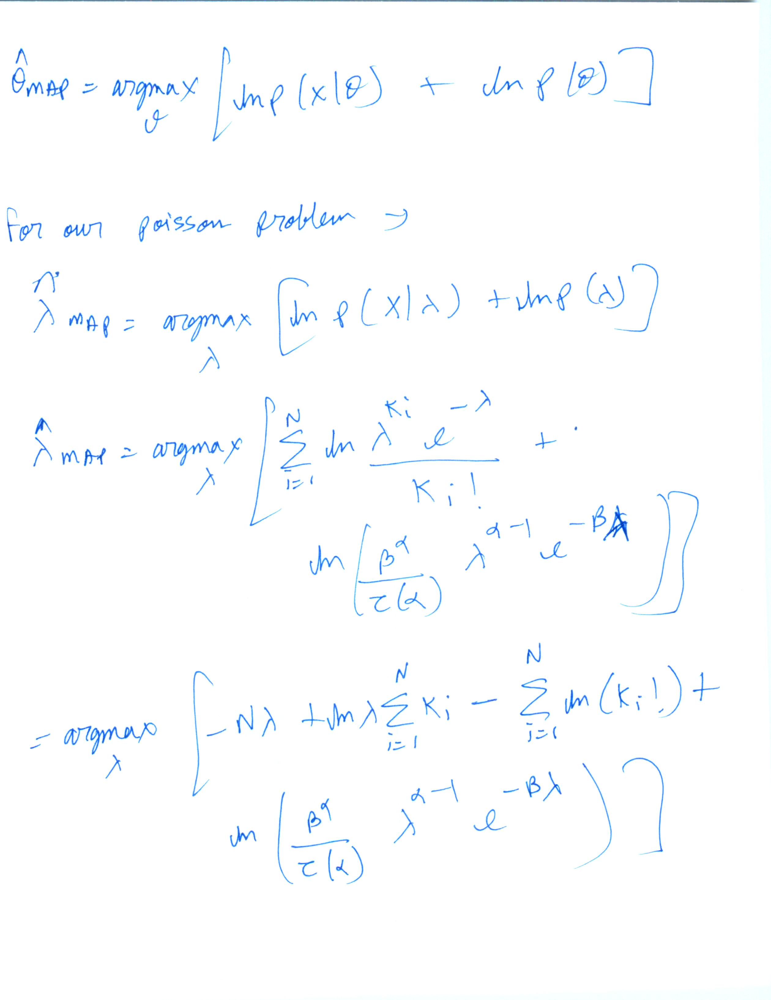

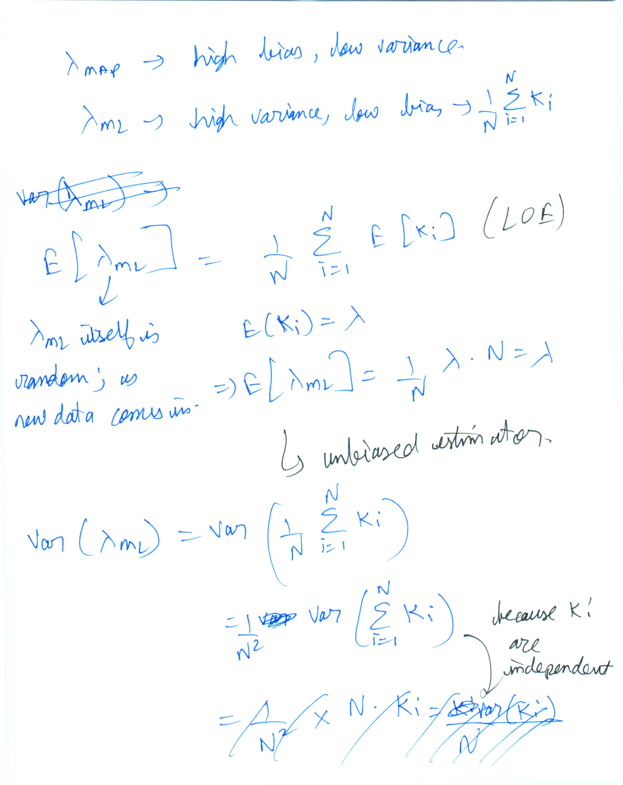
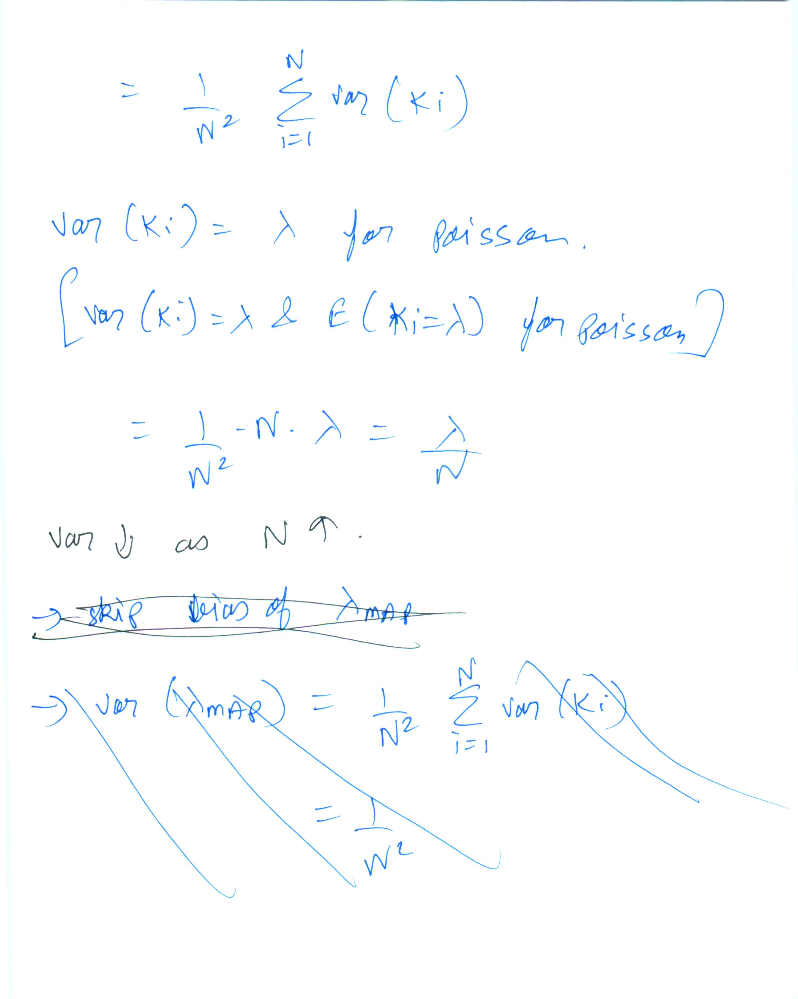
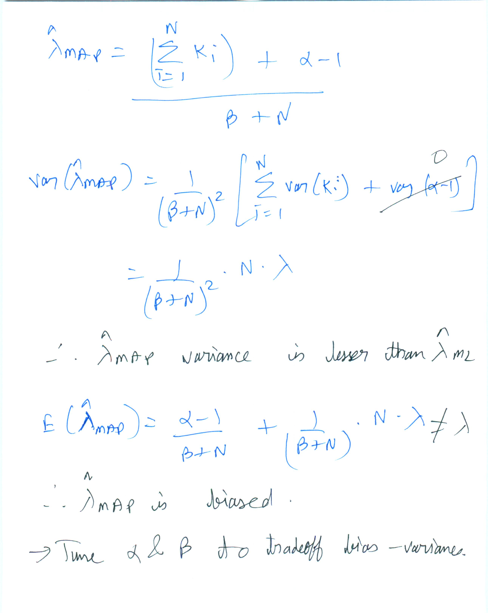
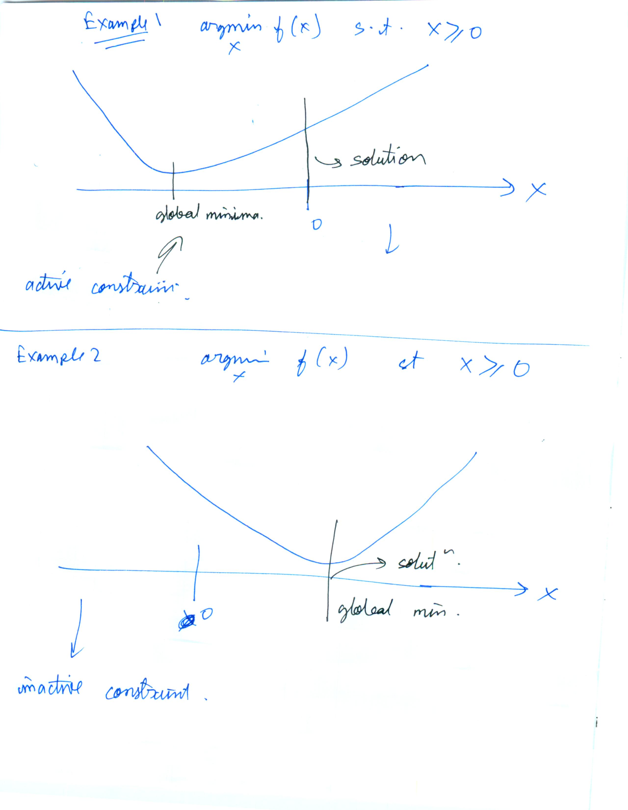
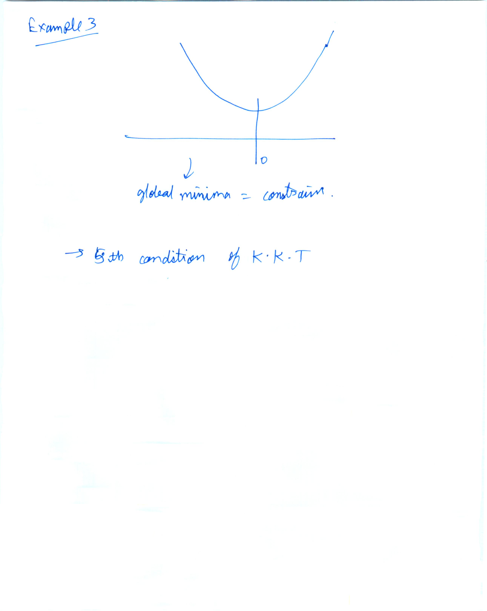
