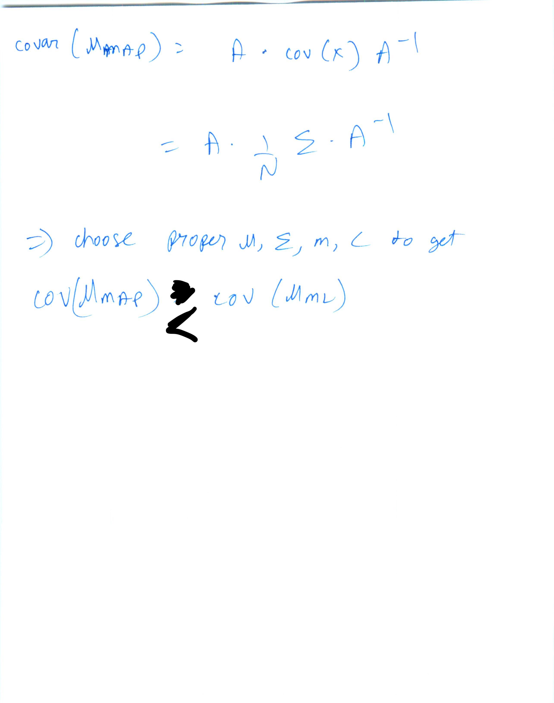

* MVU estimators are intractable most of the times
* Cramer Rao lower bound
* https://en.wikipedia.org/wiki/Cram%C3%A9r%E2%80%93Rao_bound#Scalar_unbiased_case
* https://en.wikipedia.org/wiki/Cram%C3%A9r%E2%80%93Rao_bound#Multivariate_case
* Refer E11_GeneralBayesianEstimators.pdf

* Choose good priors. Will help in reducing variance. Yes, even if you start with bad priors, you will converge to unbiased ML estimate as samples increase. But we want to take the advantage of good prior, and not rely on infinite samples
* We sacrifice a bit on bias by considering priors in hope we gain a lot in variance
* Paramater estimations in these lectures gave simple analytical solutions. Doesn't happen always. Eg. GMM. Needs iterative EM algorithm to solve it
